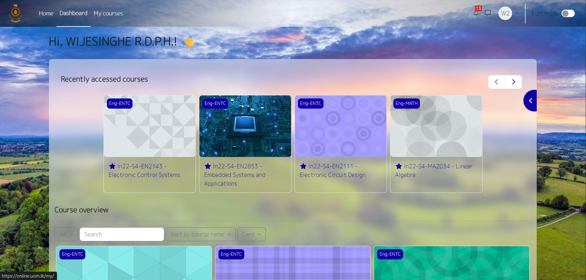
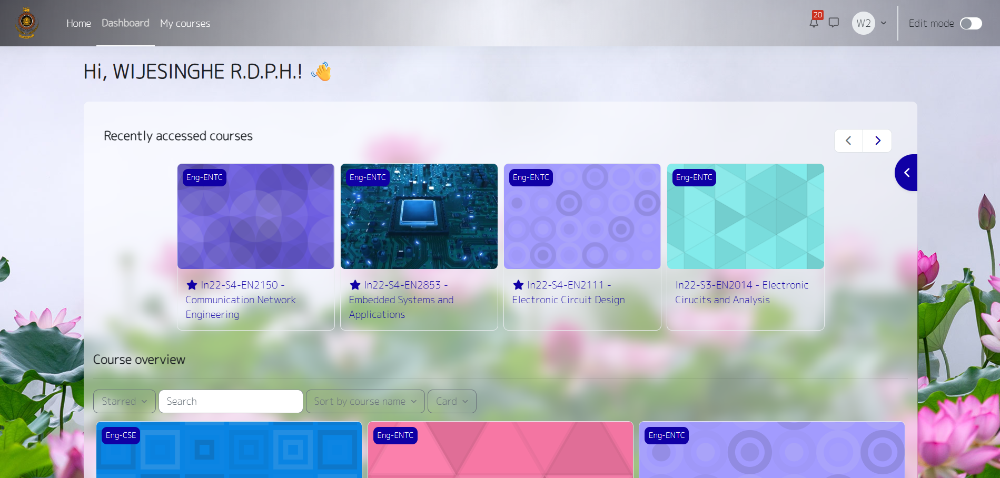
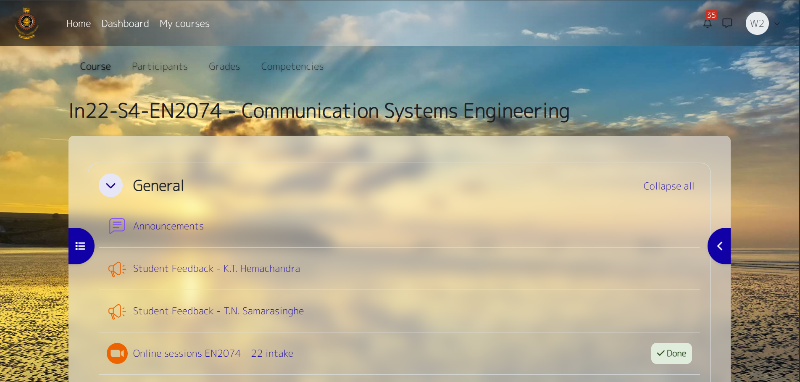

# UoM Model - Chrome Extension

A sleek and modern Chrome extension built for the University of Moratuwa (UoM) community!  
Features a **new custom UI theme**, minimalistic design, and **daily refreshing wallpapers** tailored to uplift your browsing experience every day.

---

## Features

- 🎨 **Custom UoM-Themed UI**  
  Brings a fresh, modern look inspired by the University of Moratuwa's identity.

- 🖼️ **Daily Changing Wallpapers**  
  Automatically updates your new tab background with high-quality wallpapers every day.

- 🧭 **Minimal and Clean Dashboard**  
  Displays essential information such as time, date, and optional quick links in a distraction-free interface.

- 🔗 **Quick Access Links (Optional)**  
  Customizable links for Moodle, Faculty portals, LMS, and other frequently used UoM tools.

- ⚙️ **Lightweight & Fast**  
  Built with performance and simplicity in mind — no unnecessary bloat!

---

## Preview

  
  

  
  

---

## Installation

1. Clone or download this repository.
2. Open Chrome and navigate to `chrome://extensions/`
3. Enable **Developer Mode** (toggle in top right).
4. Click **Load unpacked** and select the extension folder.
5. Enjoy your new UoM-themed browsing experience!

---

## Technologies Used

- HTML5 / CSS3 / JavaScript (Vanilla)
- Chrome Extension APIs
- Custom Wallpaper API (or local image rotation)

---

